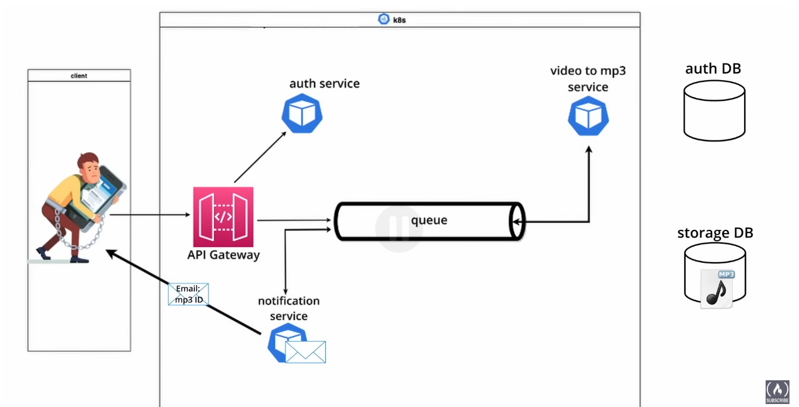

# Microservice Architecture
- 

- What is microservice Architecture?
    - is a type of architecture where the application is developed as a collection of services
    - Each service is a small, independent process that runs in its own process and communicates with other services through well-defined APIs.
    - Each service is responsible for a specific functionality and can be scaled independently.
    - Each service is developed and deployed independently.

